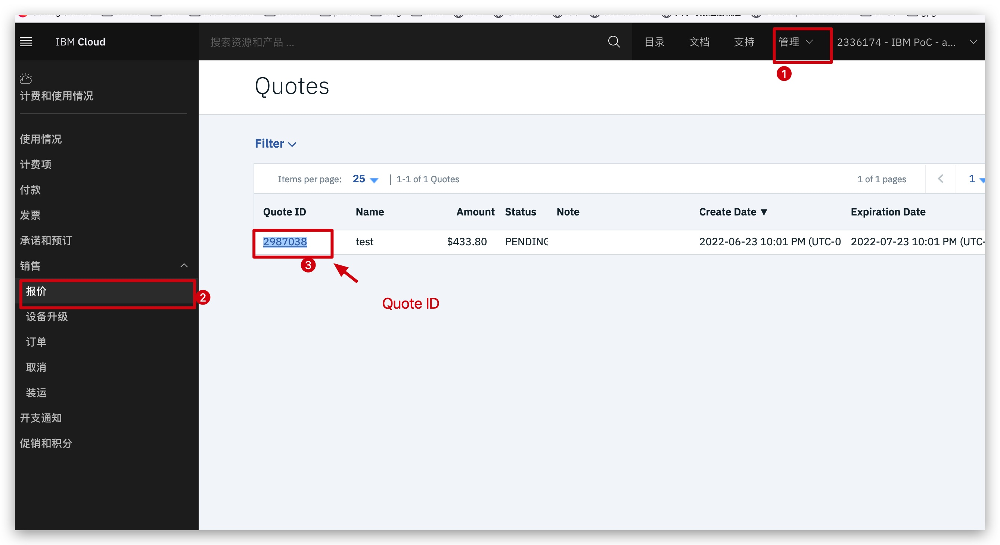
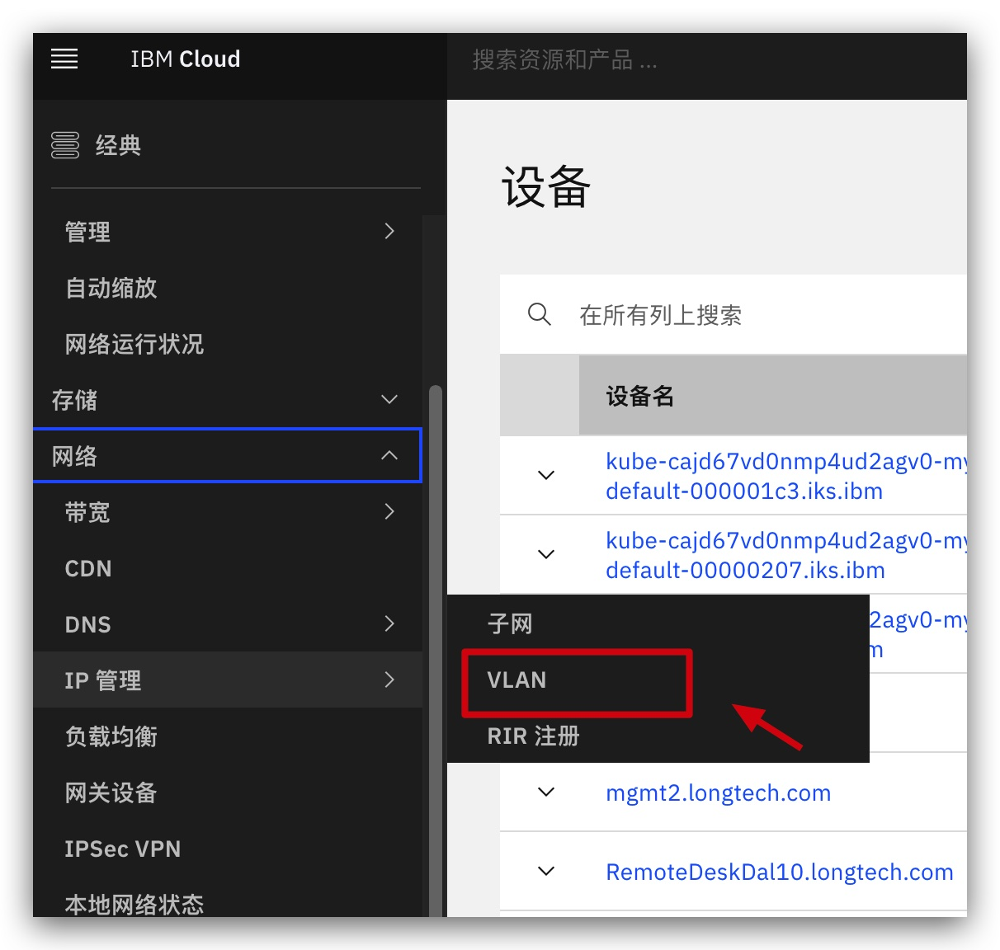
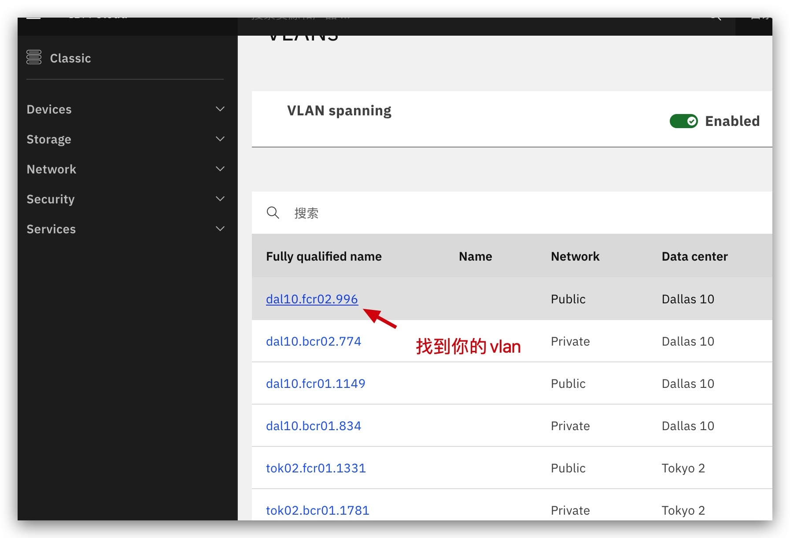
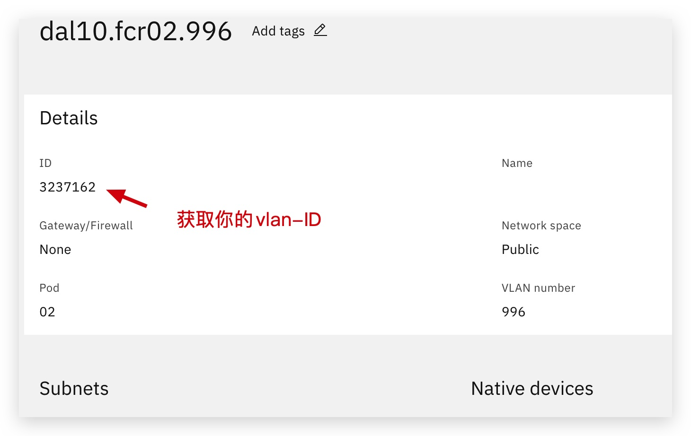

# order_by_quote

使用quote 批量下单，自动生成有规则的设备名称，避免手动输入带来的繁琐。

## 安装依赖性包
pip3 install SoftLayer

## 准备环境
    ```
      # 设置SL API key 到环境变量
      touch SL_ENV.sh
      echo "export SL_USERNAME=apikey" >  touch SL_ENV.sh
      echo "export SL_API_KEY=<替换为你自己的秘密>" >>  touch SL_ENV.sh
      source SL_ENV.SH
    ```

## 使用举例
    创建2台设备名称为   
    - s192-dal9.test.com
    - s193-dal9.test.com
    的设备。

    ```
     ./order_by_quote.py --quote_id=2987038 --quantity=2 --provisionScripts="https://10.1.1.1/init.sh" --prefix="s" --index=192 --suffix="-dal9" --domain="test.com" private_vlan=3250707
    ```
    上面这个命令将创建 2台(`--quantity=2`)物理机，  
    两台物理机的名字分别为 `s192-dal9.test.com` 和 `s192-dal9.test.com`，  
    这些物理机的名字是由参数  `--prefix` , `--index`，`--suffix` 和 ` --domain` 四部分组合而成，  
    这些物理机使用quote 为2987038, 由 `quote_id`指定， 并且他们将在vlan 3250707 内被创建。  

## 参数说明
 - `quote_id`             IBM 客户经理为您设置的优惠 quote ID
 - `quantity`             下单的设备数量
 - `provisionScripts`     设备初始化脚本
 - `prefix`               设备名称前缀 
 - `index`                设备名称的索引号吗，向下顺延
 - `suffix`               后缀名称，可省略
 - `domain`               设备的域名
 - `private_vlan`         私有VLAN 号吗 
 - `public_vlan`          公有VLAN 号吗， 可省略

## 如何获取您的 quote ID
  - 管理（右上）——> 计费和使用情况 ——> 销售  ——> 报价 ——>  Quota ID
  
## 如何获取您的 vlan ID 

  - 经典架构 ——> 网络 ——> ip管理 ——> VLAN  
    
  - 找到你的内网VLAN 点进去，注意网络类型为 Private
     
  - 获取你的vlan id·
    